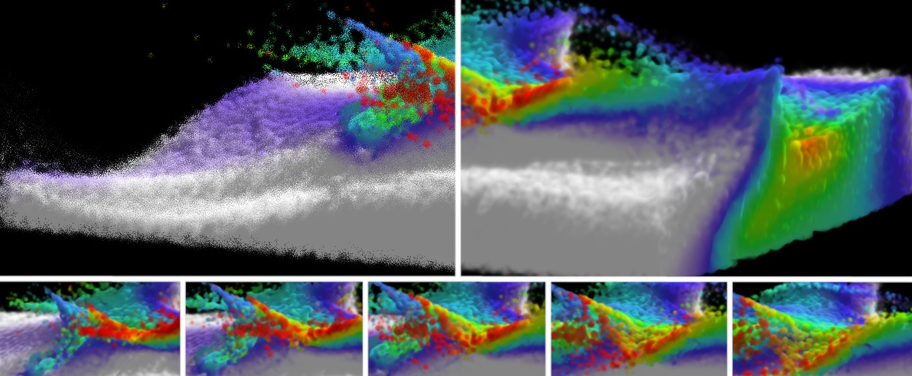

[](https://opensource.org/licenses/MIT)
[](https://github.com/natevm/vkrt/actions/workflows/ci.yml)

# GPRT (General Purpose Raytracing Toolkit)



GPRT is a ray tracing API that wraps the Vulkan ray tracing interface.

## Dependencies

  - CMake
  - C++17
  - Vulkan SDK (>= 1.3.231.1)

## Documentation
GPRT's documentation can be found [here](https://gprt-org.github.io/GPRT/).

## Cloning
This repository contains submodules for external dependencies, so when doing a fresh clone you need to clone recursively:

```
git clone --recursive git@github.com:gprt-org/GPRT.git
```

Existing repositories can be updated manually:

```
git submodule init
git submodule update
```

## Build Instructions

Install the [Vulkan SDK](https://vulkan.lunarg.com/) for your platform (version 1.3.231.1 or greater).

GPRT uses CMake for configuration. For an empty directory, `build`, in the top
directory of this repository, the project can be configured with

```shell
cmake ..
```

and built with

```shell
cmake --build .
```

## Ubuntu Dependencies

The following apt-packages should be installed:

```shell
sudo apt install xorg-dev libxinerama-dev libglu1-mesa-dev freeglut3-dev mesa-common-dev libglfw3
```

along with the [Vulkan SDK](https://vulkan.lunarg.com/doc/view/latest/linux/getting_started_ubuntu.html).

Note: if using Ubuntu 22 with Wayland (or other distros for that matter), the above x11 dev packages still work via xwayland.
